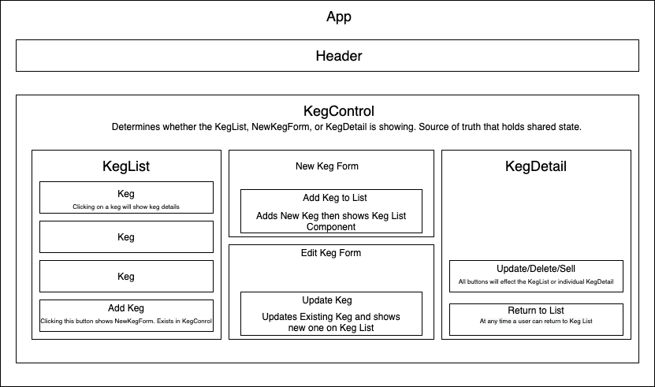

This project was bootstrapped with [Create React App](https://github.com/facebook/create-react-app).
# React Taproom Independent Project

## _By: Andrew Kim_

## Intro

This project will display a taproom that incorporates the use of shared and local state using React. 

## Description

On page load, a user will be able to see a list of kegs generated from a fake keg service, which mirrors JSON data. A user can then click on a Keg to render a new component that shows details about the keg. From there, they can update, sell pints, or delete kegs. Kegs can also be added to the KegList and updated, deleted, and sold. When a user clicks the "Add Keg" button, the KegList component will be hidden and the user will see the NewKegForm component instead.

 KegControl will need to have local state to determine which of the following states the page should be in:
 
 KegList showing and NewKegForm hidden;
 NewKegForm showing and KegList hidden.
 
 Shared state will be with our masterKegList state slice. 

## Setup/Installation

Clone the repo, cd into 'taproom' and npm install. 

In the project directory, you can run:

### `npm start`

Runs the app in the development mode. 
Open [http://localhost:3000](http://localhost:3000) to view it in the browser.

The page will reload if you make edits. 
You will also see any lint errors in the console.

## Component Diagram

## Support and Contact Details

If you run into issues with the code email me at andrewswkim47@gmail.com

## Technologies Used

React, create-react-app which packages our node modules, react-reveal, and react-bootstrap for UI

## License

Copyright (c) 2020 Andrew Kim

